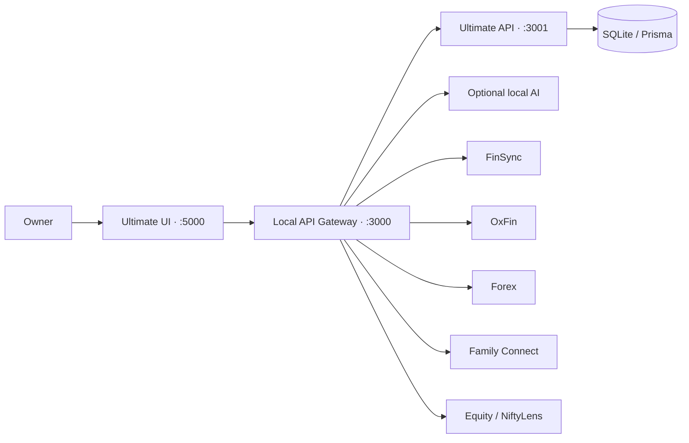

<div align="center">

# GrowthTrack Ultimate

### One private workspace for health, finance, work, family, and intelligent insights.

**A local-first personal operating system with six independently runnable products, one secure gateway, and one refined control center.**

[Explore the workspace](#workspace) · [Start locally](#quick-start) · [Read the architecture](docs/ARCHITECTURE.md) · [View the design system](growthtrack-ultimate/docs/DESIGN_SYSTEM.md)

</div>

---

## Overview

GrowthTrack Ultimate brings everyday personal operations into one cohesive environment. Ultimate is the command center; FinSync, OxFin, Forex, Family Connect, and Equity/NiftyLens remain focused products that can run independently or open through the shared Apps Hub.

The experience is designed around four principles:

- **Private by default** — local owner authentication, local persistence, and optional integrations.
- **Useful as a whole or in parts** — every companion product keeps its standalone runtime.
- **Calm, premium interaction** — adaptive light and dark themes, refined glass surfaces, meaningful motion, and accessible controls.
- **Operationally visible** — product health, request IDs, session activity, audit events, and system diagnostics are observable from Ultimate.

> [!IMPORTANT]
> This repository does not contain usable credentials. Create local secrets in ignored `.env` files from the supplied examples. Never commit passwords, encryption keys, handoff secrets, tokens, private database files, or production URLs.

## Workspace

| Product | Purpose | Runtime | Local UI |
|:--|:--|:--|:--|
| **Ultimate** | Personal command center, Apps Hub, logs, AI, wellness, work, finance, and digital physique | React + Vite | `http://127.0.0.1:5000/Ultimate/` |
| **FinSync** | Budgeting, transactions, banking workflows, and financial planning | Next.js | `http://localhost:5101` |
| **OxFin** | Wallets, cards, bills, investments, and financial intelligence | Next.js | `http://localhost:5102` |
| **Forex** | Exchange-rate forecasting, model analytics, and prediction tools | Streamlit + Python | `http://localhost:8501` |
| **Family Connect** | Family spaces, shared memories, events, and private documents | React + Vite | `http://localhost:5104` |
| **Equity / NiftyLens** | Indian-market charts, indicators, option chains, and alerts | Next.js | `http://localhost:5105` |

All API traffic enters through the local gateway at `http://localhost:3000`. Product routes use stable namespaces such as `/api/ultimate`, `/api/finsync`, and `/api/equity`.

## Experience highlights

### Ultimate command center

- Unified overview for current priorities, wellness, money, workspace, and life.
- Responsive desktop sidebar and mobile navigation with keyboard-first interaction.
- Apps Hub with live product readiness, launch guidance, API visibility, and secure handoff.
- Global command and search surfaces for fast navigation.

### Health and digital physique

- Fitness, nutrition, sleep, hydration, medical metrics, progress, and training workflows.
- Interactive Three.js digital-human experience driven by body metrics.
- Capability-aware rendering with quality tiers and a graceful 2D fallback when WebGL is unavailable.
- Responsive charts with loading guards, accessible summaries, and reduced-motion behavior.

### Finance and productivity

- Budgets, portfolios, calculators, goals, tasks, projects, documents, notes, calendars, and timesheets.
- Persistent Zustand stores with additive migration support.
- Independent FinSync, OxFin, Forex, and NiftyLens experiences connected through the gateway.

### AI and operations

- Local AI workspace designed for Ollama with clear offline and recovery states.
- Unified Auth, Session, Audit, and System log views.
- Filtering, pagination, diagnostics, exports, request IDs, and controlled logging self-tests.
- Non-blocking logging: observability failures do not break the user operation being recorded.

## Design system

Ultimate uses a forward-looking, iOS-inspired visual language without copying proprietary interfaces.

| Foundation | Implementation |
|:--|:--|
| **Color** | Semantic system blue for actions; green reserved for success; adaptive light/dark surfaces |
| **Typography** | SF Pro-style system stack with Inter and Segoe UI fallbacks |
| **Materials** | Restrained translucency, hairline borders, continuous corners, and controlled depth |
| **Motion** | Fast CSS transitions and purposeful spring motion with reduced-motion alternatives |
| **Accessibility** | 44px minimum targets, visible focus, semantic states, keyboard support, and WCAG-oriented contrast |
| **Adapters** | Shared design tokens adapted to React/Vite, Next.js/Tailwind, and Streamlit |

Read [DESIGN_SYSTEM.md](growthtrack-ultimate/docs/DESIGN_SYSTEM.md) before introducing new visual patterns. Companion adapters are documented in [SHARED_DESIGN_ADAPTERS.md](docs/SHARED_DESIGN_ADAPTERS.md).

## Architecture



- The gateway exposes stable product namespaces and aggregate readiness.
- Ultimate's API remains internal to the workspace and owns local identity.
- Companion apps retain their native framework, build, and deployment model.
- Short-lived, audience-bound handoffs connect authenticated launches without sharing passwords.
- Heavy routes, charts, and 3D modules are loaded progressively.

More detail is available in [WORKSPACE.md](WORKSPACE.md) and [docs/ARCHITECTURE.md](docs/ARCHITECTURE.md).

## Quick start

### Prerequisites

- A current Node.js LTS release and npm
- Python with a local virtual environment for Forex
- Ollama only if local AI features are required

### 1. Configure Ultimate

```powershell
Copy-Item growthtrack-ultimate/.env.example growthtrack-ultimate/.env
npm install --prefix growthtrack-ultimate
npm run db:sync
```

Open `growthtrack-ultimate/.env` locally and provide your own owner credentials and cryptographic secrets. The example file intentionally contains no secret values.

### 2. Start the control center

```powershell
npm run dev
```

Open `http://127.0.0.1:5000/Ultimate/`. The launcher reuses services only when their health checks pass and keeps the standard ports fixed.

### 3. Start the complete workspace

Install each companion product's dependencies once, then run:

```powershell
npm run dev:all
```

Individual launch commands are also available:

```powershell
npm run dev:gateway
npm run dev:ultimate
npm run dev:finsync
npm run dev:oxfin
npm run dev:forex
npm run dev:family
npm run dev:equity
```

See [WORKSPACE.md](WORKSPACE.md) for canonical product roots, framework-specific setup, health routes, and troubleshooting.

## Security and privacy

- Local owner authentication uses protected sessions, CSRF validation, password hashing, and rate limiting.
- Integration handoffs are short-lived, audience-bound, signed, and one-time use.
- Return destinations are validated against the product registry.
- Sensitive settings belong in environment files and are never rendered in diagnostics.
- Operational logs contain safe metadata and request references—not passwords, tokens, encryption material, or full secret-bearing payloads.
- Optional analytics, monitoring, billing, cloud identity, location, and AI providers remain disabled until explicitly configured.

For public screenshots or bug reports, redact names, email addresses, request payloads, database contents, tokens, and machine-specific paths.

## Quality checks

```powershell
npm run design:check   # verify generated design adapters
npm run build          # production build for Ultimate
npm test               # Ultimate unit and integration tests
npm run test:gateway   # gateway routing and security tests
```

Additional browser, accessibility, 3D, and product-specific verification commands are listed in [UX_UPGRADE_VERIFICATION.md](docs/UX_UPGRADE_VERIFICATION.md).

## Repository map

```text
Tracker/
├── growthtrack-ultimate/   # Control center, API, database schema, desktop build
├── FinSync/                # FinSync web/mobile and the OxFin product family
├── Forex/                  # Canonical Streamlit forecasting product
├── Family Connect/         # Family Connect frontend and backend
├── Equity/NiftyLens/       # Market intelligence product
├── scripts/                # Workspace launcher, gateway, design synchronization
├── tests/                  # Cross-product and gateway verification
└── docs/                   # Architecture, adapters, changelog, verification
```

The nested Forex ensemble directory is retained as legacy/reference material; `Forex/` is the canonical launcher target.

## Documentation

- [Workspace operations](WORKSPACE.md)
- [Architecture overview](docs/ARCHITECTURE.md)
- [Ultimate design system](growthtrack-ultimate/docs/DESIGN_SYSTEM.md)
- [Shared framework adapters](docs/SHARED_DESIGN_ADAPTERS.md)
- [Migration guide](MIGRATION_GUIDE.md)
- [Verification matrix](docs/UX_UPGRADE_VERIFICATION.md)
- [Changelog](docs/CHANGELOG.md)

## Project status

GrowthTrack Ultimate is under active development. It is designed primarily as a private, local workspace. Optional external providers require separate configuration and may have their own availability, privacy, and billing requirements.

No open-source license is currently included. Unless a license is added, the repository should be treated as **all rights reserved**.

---

<div align="center">

**GrowthTrack Ultimate** · Your life, clearly connected.

</div>
