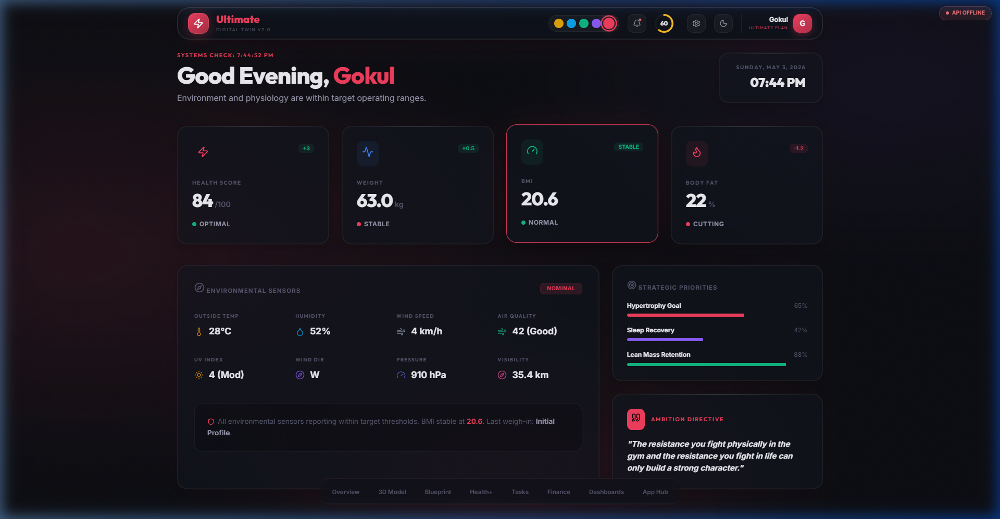
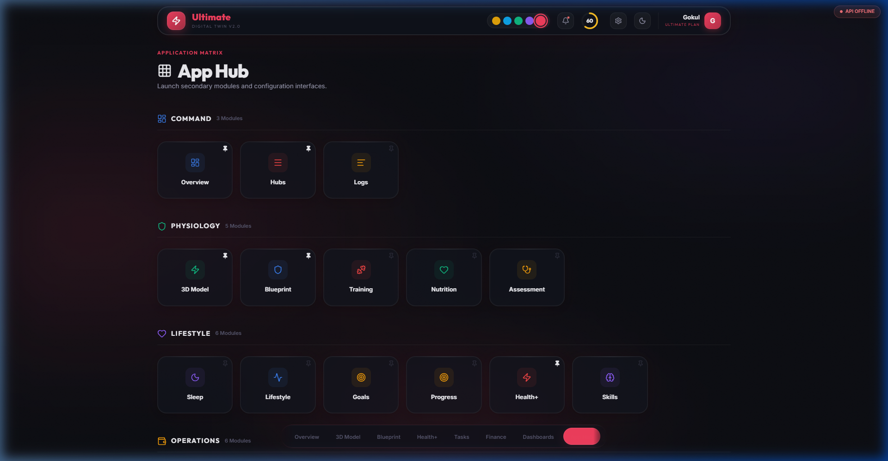
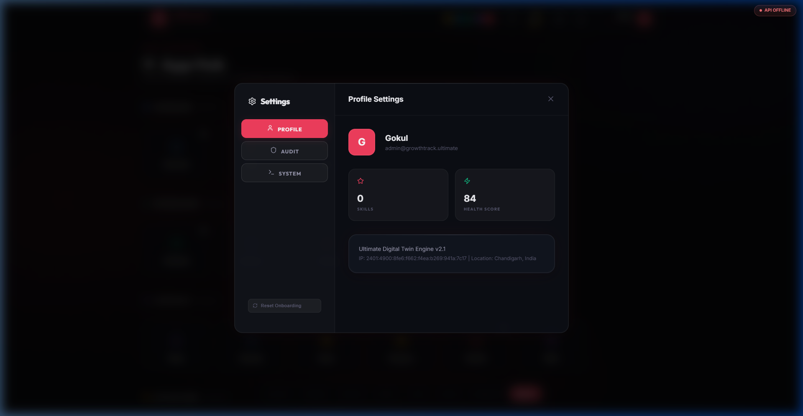

# ⚡ Ultimate — Digital Twin Engine

> **The definitive sovereign tracking ecosystem.**
> GrowthTrack Ultimate is a hyper-premium, glassmorphic digital twin platform designed for deep biological, cognitive, and environmental tracking.

*Watch the live demo GIF on the [Live Site](https://gokulsenthilkumar3.github.io/Ultimate/) or see the preview above.*

## 🌌 Overview

Ultimate isn't just a dashboard; it's a **tactical command center** for your biological and environmental state. Built with a focus on sovereign data, photorealistic 3D modeling, and real-time audit tracing, it provides a deterministic view of your progress.

## ✨ Key Features

### 🏢 Command Center

- **Overview Dashboard**: A high-fidelity view of your health score, environmental sensors, and strategic priorities.
- **App Hub**: A grouped matrix of 30+ specialized modules ranging from 3D Physique modeling to Financial Planning.
- **Audit Trail**: Real-time logging of every system transaction for full data sovereignty.

### 🧬 Physiology & Lifestyle

- **3D Morph Engine**: Visualize body transformations with high-accuracy 3D models.
- **Vascularity Sync**: Real-time integration between 2D metrics and 3D textures.
- **Nutrition & Training**: Deep tracking of metabolic inputs and tactical outputs.

### 🛠️ Operations & Library

- **Finance & SIP**: Integrated financial planning and asset tracking.
- **Project Matrix**: Manage complex workflows alongside your physiological data.
- **Media Library**: A unified hub for your research, documents, and entertainment.

## 📸 Screen Gallery

| **App Hub Matrix** | **Settings & System Audit** |
| :---: | :---: |
|  |  |

## 🗺️ Roadmap

We are tracking our development phases using [GitHub Milestones](https://github.com/gokulsenthilkumar3/Ultimate/milestones) and [Issues](https://github.com/gokulsenthilkumar3/Ultimate/issues).

- **Phase 1**: Persistence Stabilization & Core Architecture (Completed)
- **Phase 2**: E2E Testing & Component Decoupling (In Progress)
- **Phase 3**: Node/Express + Supabase REST API Migration (Upcoming)
- **Phase 4**: Advanced Predictive Triage & Mobile App (Future)

## 🚀 Tech Stack

- **Frontend**: React 18 + Vite
- **Styling**: Vanilla CSS (Premium Glassmorphism)
- **3D Engine**: Three.js / React Three Fiber
- **State**: Zustand (Atomic State Management)
- **Backend**: Node.js / Express / SQLite3
- **Performance**: Full React.lazy code-splitting & PWA support

## 🛠️ Getting Started

1. **Clone the repo**
2. **Install dependencies**: `npm install`
3. **Start the engine**: `npm run dev`
4. **Visit**: `http://localhost:5173/Ultimate/`

---

© 2026 Ultimate Digital Twin · Deterministic System · Locally Hosted
